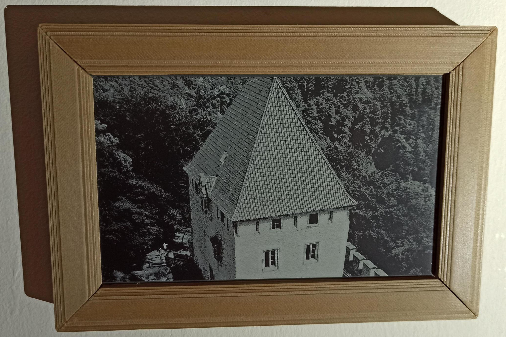

# Micropython EInk drivers

Various EInk displays drivers written for [Micropython](https://docs.micropython.org/en/latest).



This driver is not intending to support all feature set provided by each display, but it rather provide
similar API for any of them. Then for example black & white display is in this API always represented as
gray scale display with 16 levels of gray. When colored display is used, then also each color is represented
by number in range from 0 to 15. User application then can easily use display regardless on if display
is gray scaled (and how much levels are supported) or if display is some kind of color variant of EInk.

The API can be split on low memory consumption and high memory consumption part.


## Low memory consumption part

This part of API provides access to display on it's native RAW content level. Disadvantage of this approach
is that each author has to know structure of RAW data of used display which can be different for each display.
Advantage is that this part of API has minimal RAM footprint. This access is also based on stream so
the screen content can be even flushed to screen directly from file system even compressed RAW data
if necessary (for compressed data is required Micropython 1.21.0 or newer):

```
from ueink.epd_gdey075t7 import Epd
from machine import Pin, SPI

epd = Epd(spi=SPI(2), cs=Pin(39), dc=Pin(40), rst=Pin(41), busy=Pin(42))

with open("zlib_compressed_screen_content.raz", "rb") as f:
    epd.flush(DeflateIO(f, ZLIB))
```


## High memory consumption part

This API consumes way more RAM as it requires to allocate frame buffer to carry display display content.
However this brings some advantages, such as uniq frame buffer structure across all displays
(always 4 bits wide pixel size), or possibility to easily rotate display by 90 degrees (transposed mode).
Drawback is usually slower flushing of the display as the frame buffer may be needed to be translated
to incompatible RAW data form.

```
from ueink.epd_gdey075t7 import Epd
from machine import Pin, SPI

epd = Epd(spi=SPI(2), cs=Pin(39), dc=Pin(40), rst=Pin(41), busy=Pin(42))

fb = epd.fb
fb.text("Hello text ;-)", 0, 0, epd.color["black"])

epd.flush()
```


## Installation

Installation of drivers to your Micropython device is fairly simple. You just need to copy following files/folders
into root of your device file system.

- Folder [mpy/ueink](https://github.com/ondiiik/ueink/tree/main/mpy/ueink) as `ueink`
- Folder [mpy/upycompat](https://github.com/ondiiik/ueink/tree/main/mpy/upycompat) as `upycompat`
- File [mpy_root/\_\_future\_\_.py](https://github.com/ondiiik/ueink/blob/main/mpy_root/__future__.py) as `__future__.py`
